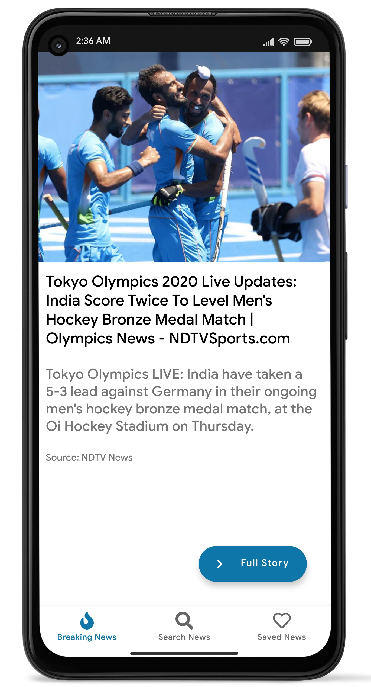
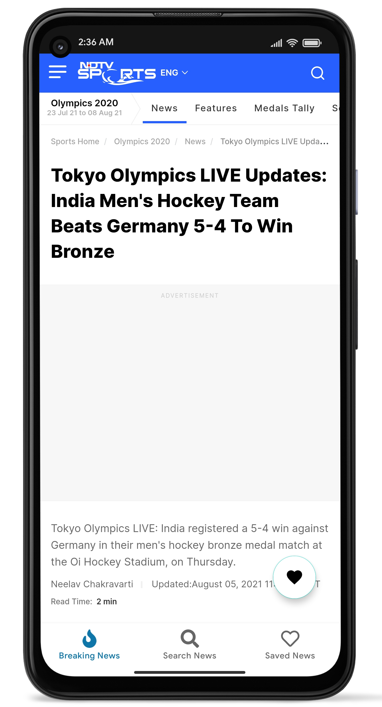
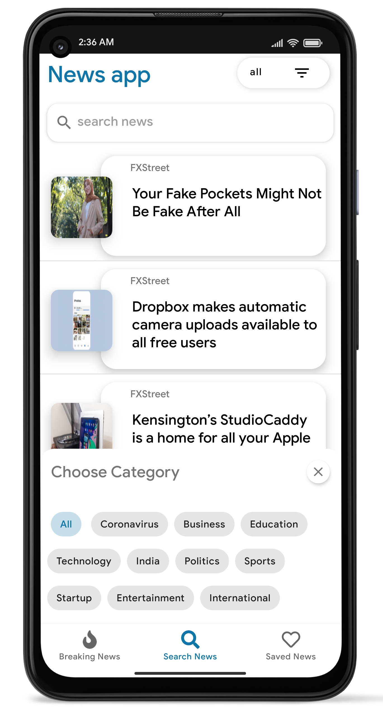

# News App

App build using Retrofit, Room DB , and MVVM which uses api from [www.newsapi.org](newsapi.org) to get the news data from various trusted sourses such as Aaj tak , NDTV , Republic etc.

## Debug APK
[Download link](https://drive.google.com/file/d/18UxJlf-fZqApXG_xfFdeL2k0nyI9o9s7/view?usp=sharing)

## Screenshots

||||
|:----------------------------------------:|:-----------------------------------------:|:-----------------------------------------: |
|  |  |  |

## Built With 🛠
- [Kotlin](https://kotlinlang.org/) - First class and official programming language for Android development.
- [Coroutines](https://kotlinlang.org/docs/reference/coroutines-overview.html) - For asynchronous and more..
- [Flow](https://kotlin.github.io/kotlinx.coroutines/kotlinx-coroutines-core/kotlinx.coroutines.flow/-flow/) - A cold asynchronous data stream that sequentially emits values and completes normally or with an exception.
- [Android Architecture Components](https://developer.android.com/topic/libraries/architecture) - Collection of libraries that help you design robust, testable, and maintainable apps.
  - [LiveData](https://developer.android.com/topic/libraries/architecture/livedata) - Data objects that notify views when the underlying database changes.
  - [ViewModel](https://developer.android.com/topic/libraries/architecture/viewmodel) - Stores UI-related data that isn't destroyed on UI changes. 
  - [ViewBinding](https://developer.android.com/topic/libraries/view-binding) - Generates a binding class for each XML layout file present in that module and allows you to more easily write code that interacts with views.
- [Glide](https://github.com/bumptech/glide) - An image loading library for Android backed by Kotlin Coroutines.
- [Material Components for Android](https://github.com/material-components/material-components-android) - Modular and customizable Material Design UI components for Android.

## Architecture
This app uses [***MVVM (Model View View-Model)***](https://developer.android.com/jetpack/docs/guide#recommended-app-arch) architecture.

  
 ## Contact
If you need any help, you can connect with me.

-prakash.r19500@gmail.com
